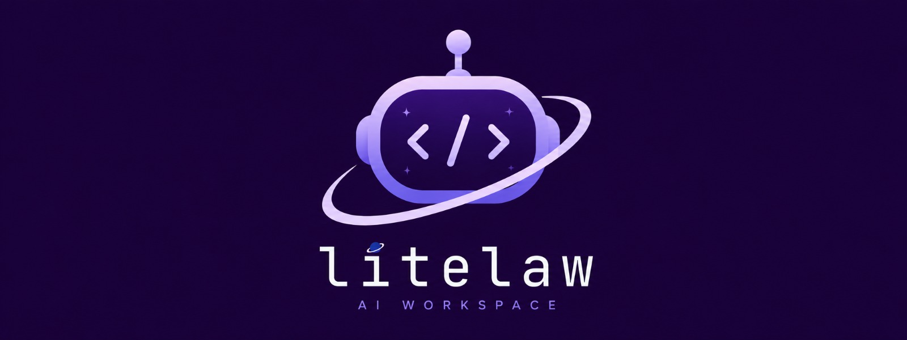

# <p align="center">⬡</p>

<h1 align="center">litelaw</h1>

<p align="center">
  <b>A lightweight local AI workspace for autonomous computer automation.</b><br>
  Built around Ollama with a modern web interface, persistent memory, multi-agent workflows, document editing, file conversion, and local-first execution.
</p>

<p align="center">


</p>

---

## Overview

**litelaw** is a lightweight local AI workspace that's perfect for you.

Instead of simply chatting, litelaw can reason through tasks, execute terminal commands, search the web, maintain long-term memory, edit documents, convert files, and coordinate multiple AI agents to solve complex workflows.

Everything is designed around being **fast**, **local**, and **minimal**.

---

# Features

## 🤖 AI Agent

- Autonomous terminal execution
- Local Ollama integration
- Context-aware conversations
- Persistent conversation history
- Automatic context trimming
- Structured reasoning loop
- Local-first architecture

---

## 👥 Multi-Agent Mode

Planner → Researcher → Coder → Executor → Reviewer

Each request can be broken into multiple specialized agents that collaborate to complete complex tasks.

Features include:

- Planner-generated task queues
- Dedicated specialist agents
- Live execution progress
- Reviewer verification
- Visual task tracking
- Shared context between agents

---

## 🧠 Persistent Memory

Long-term memory survives application restarts.

Store:

- User preferences
- Coding styles
- Frequently used instructions
- Project-specific context
- Permanent AI behavior rules

---

## 💬 Chat Workspace

- Multiple conversations
- Chat history
- Automatic thread titles
- Conversation persistence
- Modern terminal-inspired interface

---

## 📝 Document Editor

Built-in document workspace for:

- Notes
- Drafts
- Temporary files
- Prompt storage
- Scratchpad editing

Supports:

- Multiple saved documents
- Instant saving
- Persistent storage

---

## 🔄 File Converter

Convert between common formats.

### Documents

- PDF → TXT
- PDF → DOCX
- DOCX → TXT
- DOCX → PDF

### Images

- PNG ↔ JPEG
- PNG → PDF
- JPEG → PDF

---

## 🌐 Web Utilities

Integrated web tools including:

- Live web search
- Browser launching
- URL opening
- Search automation
- Platform-specific search shortcuts

---

## 📅 Calendar & Reminders

- Calendar view
- Reminder management
- Persistent reminders
- Daily planning

---

## 🧮 Calculator

Built directly into the workspace.

- Basic arithmetic
- Fast calculations
- Keyboard-friendly

---

## 💻 Computer Automation

Execute local commands using AI.

Examples include:

- File management
- Git workflows
- Environment inspection
- Package management
- Archive extraction
- System diagnostics
- Networking tools
- Python automation

---

## 🎨 Modern Interface

- Dark futuristic theme
- Purple aesthetic
- Responsive layout
- JetBrains Mono Nerd Font
- Sidebar navigation
- Smooth scrolling
- Terminal-inspired design

---

# Project Structure

```text
litelaw/
│
├── app.py
├── litelaw.py
└── litelaw_store.json
```

---

# Prerequisites

Before installing, ensure you have:

- Python 3.10 or newer
- Ollama installed
- Git (optional)
- A supported Ollama model

Recommended model:

```
gemma3:1b
```

Pull the model:

```bash
ollama pull gemma3:1b
```

Start Ollama:

```bash
ollama serve
```

---

# Installation

## 1. Clone the repository

```bash
git clone https://github.com/excellogalihs/litelaw.git

cd litelaw
```

---

## 2. Install dependencies

```bash
pip install flask pillow python-docx pypdf ddgs
```

---

## 3. Start Ollama

```bash
ollama serve
```

---

## 4. Download the model

```bash
ollama pull gemma3:1b
```

---

## 5. Launch litelaw

```bash
cd /path/to/litelaw
python app.py
```

Open:

```
http://127.0.0.1:5000
```

---

# Requirements

```
Python >= 3.10

flask
pillow
python-docx
pypdf
ddgs
Ollama
```

---

# Usage

Ask litelaw naturally.

Example prompts:

```
Create a Python Flask app.

Find every ISO in Downloads.

Search the web for the latest Linux kernel.

Convert this PDF into a DOCX.

Create a new document called notes.txt.

Open YouTube and search for lo-fi music.
```

---

# Roadmap

- [ ] Deep Research mode
- [ ] Better browser automation
- [ ] Voice interaction
- [ ] Plugin system
- [ ] Native code editor
- [ ] Workspace tabs
- [ ] Model manager
- [ ] RAG knowledge base
- [ ] Better web scraping
- [ ] OCR support
- [ ] Image generation
- [ ] Workflow automation
- [ ] MCP integration
- [ ] Local vector memory

---

# Philosophy

litelaw is built around four ideas:

- Local-first
- Lightweight
- Transparent
- Fast

No unnecessary cloud services.

No subscriptions.

Just your computer and your AI.

---

# Contributing

Contributions are welcome.

1. Fork the repository
2. Create a feature branch
3. Commit your changes
4. Open a Pull Request

---

# License

This project is licensed under the MIT License.

---

<p align="center">
⬡<br><br>

<b>litelaw</b><br>

Lightweight Local AI Workspace
</p>
